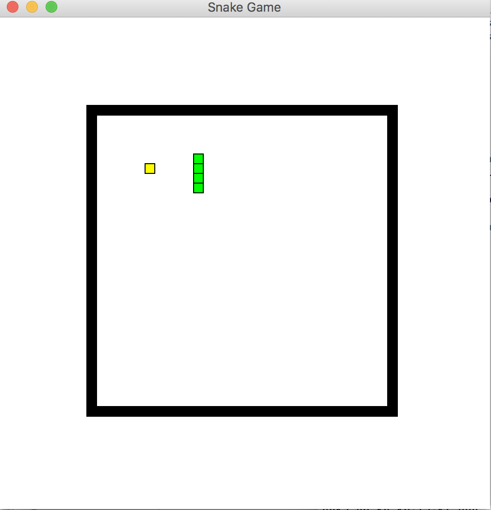

# snake-game

Welcome to my open source project!

Currently, I use the `tkinter` library to implement the GUI of the game.  It looks like this:

I look forward for your contribution to support more fancy GUI such as `PyQT` and `Pygame`. Also welcome to improve the game function.

